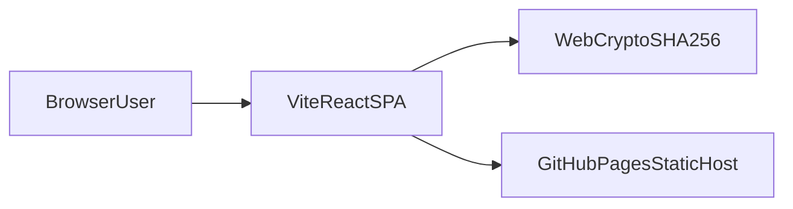
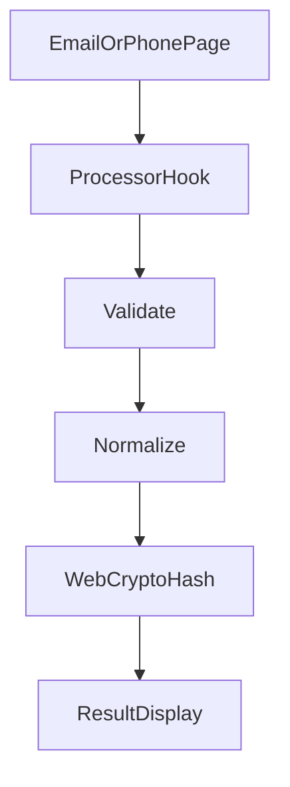
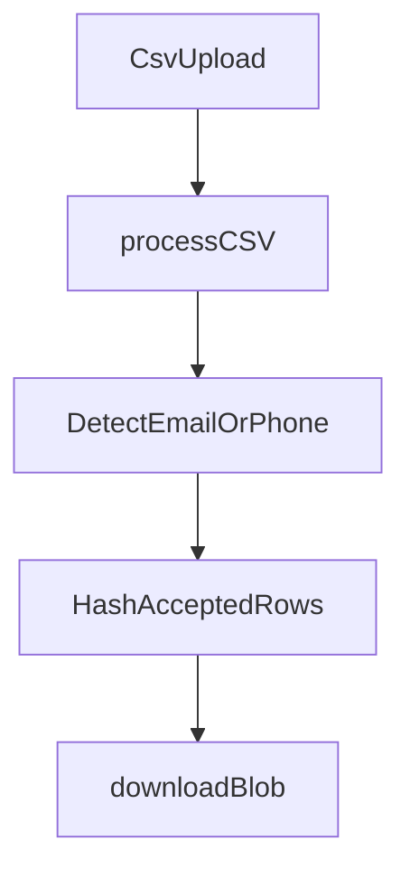
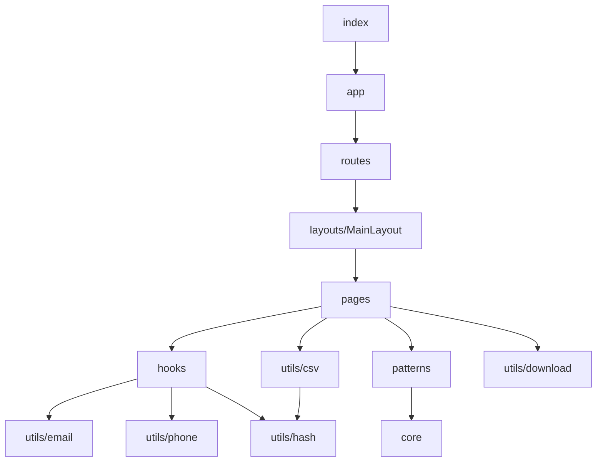

# DII Operator architecture

This document gives the high-level system architecture of the DII Operator web app.

## Purpose and scope

DII Operator is a **client-only** SPA.
It normalizes and hashes **emails** and **phone numbers** using UID2-oriented rules.
It can also process a one-column **CSV** batch and download hashed results.

This file covers:

- The monorepo and `apps/web` module map
- Single-value and CSV data flows
- Routing, shell layout, and GitHub Pages hosting
- Hashing posture (Web Crypto)
- Build and deploy shape
- Extension points at a high level

This file does **not** cover:

- Full product usage — see [README.md](../../README.md)
- Normalize/hash edit rules — see [dii-normalize](../skills/dii-normalize/SKILL.md) and [reference.md](../skills/dii-normalize/reference.md)
- Agent index — see [AGENTS.md](../../AGENTS.md)

## System context

The user opens the static site in a browser.
The Vite SPA runs entirely in the client.
Normalization and SHA-256 digests use the **Web Crypto** API in that browser.
There is no application BFF and no server-side hashing.

GitHub Pages hosts the built files under the `/dii-operator/` base path.



## High-level flows

### Single email or phone

1. The page collects input and calls a processor hook.
2. The hook validates, then normalizes via `utils/email` or `utils/phone`.
3. The hook awaits hash helpers in `utils/hash`.
4. The page renders normalized value, hex digest, and Base64 digest via `ResultDisplay`.



### CSV batch

1. `BatchNormalizer` accepts a CSV file (drag/drop or file picker).
2. `processCSV` reads text, classifies each cell as email, phone, or unknown, and hashes accepted rows.
3. The page builds a CSV string and downloads it with `downloadBlob`.

Unknown or invalid rows increment `skippedRows`.
Non-empty line count must stay at or under `10_000`.



## Module map

Application source lives under [`apps/web/src`](../../apps/web/src).

| Area | Role |
| ---- | ---- |
| `index.tsx` | Theme provider, CssBaseline, Sora font imports, React root |
| `app.tsx` | `BrowserRouter` with basename `/dii-operator` |
| `routes/app-routes.tsx` | Nested routes under `MainLayout` |
| `pages/` | Overview, Email, Phone, Batch screens |
| `hooks/` | Email and phone process state machines |
| `utils/email` | Email validate and normalize |
| `utils/phone` | Phone validate and normalize |
| `utils/hash` | Async SHA-256 hex and Base64 digests |
| `utils/csv` | Batch classify, normalize, hash |
| `utils/download` | Native blob download helper |
| `components/core` | Leaf UI (for example `CopyButton`) |
| `components/patterns` | Composed UI (for example `ResultDisplay`) |
| `components/layouts` | App chrome (`MainLayout`) |
| `types/` | Shared TypeScript contracts |
| `styles/theme.ts` | MUI dark navy theme |



## Routing and shell

[`app.tsx`](../../apps/web/src/app.tsx) sets `BrowserRouter` basename to `/dii-operator`.
[`app-routes.tsx`](../../apps/web/src/routes/app-routes.tsx) nests section routes in `MainLayout`:

| Path | Page |
| ---- | ---- |
| `/` | Overview |
| `/email` | Email normalizer |
| `/phone` | Phone normalizer |
| `/csv` | Batch normalizer |
| `*` | Redirect to `/` |

Vite `base` is `/dii-operator/`.
The Vite config copies `dist/index.html` to `dist/404.html` so GitHub Pages can serve deep links.

## Hashing posture

Hash helpers live in [`utils/hash/generate.ts`](../../apps/web/src/utils/hash/generate.ts).

- Digests use `crypto.subtle.digest("SHA-256", …)` with `TextEncoder` UTF-8 bytes.
- Hex and Base64 **must** share one digest when both are needed (`generateSha256Pair` / `generateEmailHashes`).
- Call sites are **async** and await before updating UI or CSV rows.
- The app does not use Node `crypto` or `crypto-js`.

Prefer platform download APIs via [`utils/download/blob.ts`](../../apps/web/src/utils/download/blob.ts).

## Build and deploy

The repo is a pnpm workspace.
Root scripts forward to `apps/web`.

```text
pnpm install
pnpm build          # tsc --noEmit && vite build → apps/web/dist
```

[`.github/workflows/publish.yml`](../../.github/workflows/publish.yml) builds on `main` and uploads `apps/web/dist` to GitHub Pages.

Quality gates (lint workflow):

- `pnpm exec biome ci .`
- `pnpm build`
- react-doctor Action

## Public surface and extension points

Extend the product in these places:

| Change | Where |
| ------ | ----- |
| New section page | `pages/<Name>/`, register in `routes/app-routes.tsx`, add nav in `MainLayout` |
| Normalize / hash rules | `utils/email`, `utils/phone`, `utils/hash` (keep Web Crypto) |
| Batch limits or export shape | `utils/csv/process.ts`, Batch page download handler |
| Visual tokens | `styles/theme.ts` (MUI palette / typography / overrides) |
| Shared leaf UI | `components/core` or `components/patterns` |

Do not add a server API for hashing unless the product posture changes on purpose.

## Verification and agent layout

Local verify commands (CI parity):

```bash
pnpm exec biome ci .
pnpm build
pnpm doctor:changed
```

Agent support lives under `.agents/`:

- `rules/` — project policy (symlink as `.cursor/rules`)
- `skills/` — domain and design skills
- `commands/` — `/doctor`, `/check`, `/verify` (symlink as `.cursor/commands`)
- `hooks/` — Biome / react-doctor after edit; sessionStart context
- `docs/` — this architecture file

See [AGENTS.md](../../AGENTS.md) for the full index.
